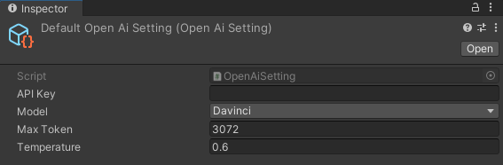
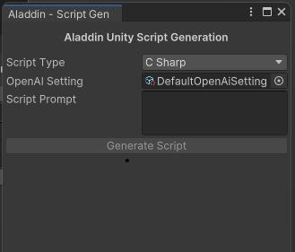
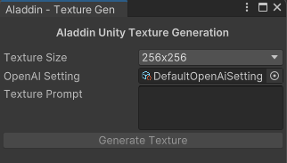
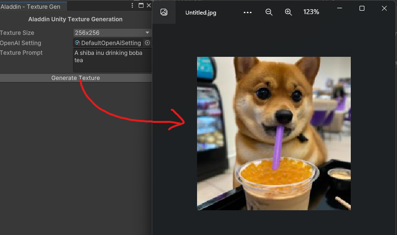
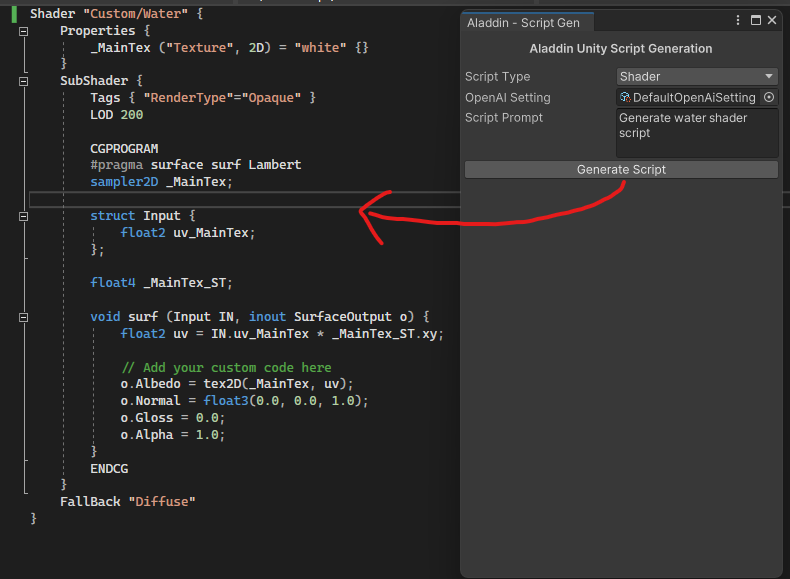

# Aladdin Unity
Aladdin is a Unity plugin uses AI to assist developers in writing code and generating textures. It aims to make the development process faster and more efficient.

## Requirements
- Unity 2020.3 or newer
- An active internet connection to use AI services
  
## Installation
1. Open your Unity project.
2. Download the latest package from Release section.
3. Import the package into your project.
4. You're ready to experience the power of AI!
   
## Usage
### Setup OpenAI API
1. Navigate to `AladdinUnity -> Resources` folder and find `DefaultOpenAISetting` asset file
    
2. Set your OpenAI API key and start creating with AI! 

### Code Generation
The code generation feature helps developers to write C# code or Shader by inputing prompt. To use it, follow these steps:

1. Open the AI Code Helper window by going to the menu bar, select `Aladdin Unity -> Script Generation`.
   
2. Select the script type you want to generate
3. Enter a brief description of what you want your code to do in the "Script Prompt"
4. Click the "Generate Script" button and save the generate script in the desire location.

### Texture Generation
The Texture Generator feature allows developers to generate textures quickly and easily, all within Unity. To use it, follow these steps:

1. Open the Texture Generator window by going to menu bar, select `Aladdin Unity -> Texture Generation`.
    
2. Choose the type of texture you want to generate from the "Texture Size" dropdown menu.
3. Click the "Generate Texture" button to generate your texture in your desire location.

## Aladdin API
### Script Generation
```
// Instantiate ChatGPTHelper
 AladdinScriptGenerator aladdin = new([OpenAiSetting]);
// Generate script
aladdin.GenerateScript([script prompt], [script type]); // Coroutine
```
### Texture Generation
```
// Instantiate DalleHelper
 AladdinTextureGenerator aladdin = new([OpenAiSetting]);
// Generate texture
aladdin.GenerateTexture([texture prompt], [texture size]); // Coroutine
```

## Demo
### Texture Generation

### Code Generation


## Next Step
 I'm planning to make Aladdin Unity a general purpose plugin (not just Unity development tooling) that developers can use in their Unity application to quickly get generative AI up and running. In fact, I'm currently using Aladdin Unity to make my own Unity app and will continuously improve it based on my experience.

 Feel free to contribute and make the plugin more developer-friendly and accessible to everyone! 

## Troubleshooting
If you encounter any issues with the plugin, please make sure that you have an active internet connection and that you're using the latest version of Unity.
If you continue to experience issues, please get in touch with me,

## License
This plugin is licensed under the MIT License. See LICENSE.txt for more information.